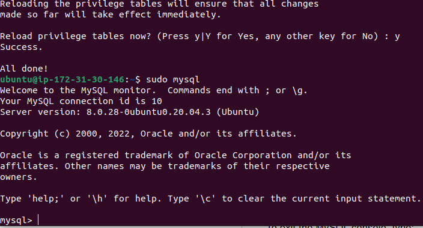
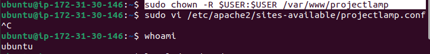

## Awesome Documentation Of DevOps Project 1: LAMP STACK IMPLEMENTATION

# Step 1 - Installing Of Apache And Updating The Firewall

Installing Of Apache Using Ubuntu's package manager:

`sudo apt update`

`sudo apt install apache2`

`sudo systemctl status apache2`

 

`http://3.208.8.211:80`

With the following page displayed that means the web server is now correcly installed and accessible through my firewall.

# Step 2 - Installing Of MySQL

`sudo apt install mysql-server`

`sudo mysql_secure_installation & Validated password plug in`

`sudo mysql`

`MySQL server is now installed and secured`

# Step 3 - Installing Of PHP

I need php, php-mysql, libapache2-mod-php to allows PHP module communicate with MySQL-based          databases and enable Apache to handle PHP files`

To install these 3 packages at once run:

`sudo apt install php libapache2-mod-php php-mysql`

To confirm PHP version run: 

`php -v`         

[] Linux (ubuntu)

[] Apache HTTP server

[] MySQL

[] PHP

At this point my LAMP stack is completely installed and fully operational.

# Step 4 - Creating a Virtual Host For My Website Using Apache

I wil set up a domain called projectlamp.

Apache on Ubuntu 20.04 has one server block, enabled by default that is configured to serve documents from the /var/www/html directory. So i will leave the configuration as it is and will add my own directory next to the default one by:

`sudo mkdir /var/www/projectlamp`

Now i will assign ownership of the directory with my current System user which is ubuntu by:

`sudo chown -R $USER:$USER /var/www/projectlamp`

To open a new configuration file in Apache's sites-available directory using preferred command-line editor. I will be using vi or vim by:

`sudo vi /etc/apache2/sites-available/projectlamp.conf`

This will create a new blank file in vi command-line editor then copy and paste the text below. 

`<VirtualHost *:80>
    ServerName projectlamp
    ServerAlias www.projectlamp 
    ServerAdmin webmaster@localhost
    DocumentRoot /var/www/projectlamp
    ErrorLog ${APACHE_LOG_DIR}/error.log
    CustomLog ${APACHE_LOG_DIR}/access.log combined
</VirtualHost>`

To save and close Hit Esc button and type :wqa! Hit Enter

To show the new file in the sites-available directory:

`sudo ls /etc/apache2/sites-available`

With this virtualHost configuration, we are telling Apache to serve projectlamp using /var/www/projectlamp as its web root directory.

To enable the new virtual host:

`sudo a2ensite projectlamp`

To disable the Apache default website, and to be sure the configuration file doesn't contain syntax errors, finally reload Apache so these change take effect:

`sudo a2dissite 000-default`

`sudo apache2ctl configtest`

`sudo systemctl reload apache2`

The new website is now active, but the web root /var/www/projectlamp is still empty. We now create an index.html file in that location so we can test that the virtual host works as expected:

`sudo echo 'Hello LAMP from hostname' $(curl -s http://169.254.169.254/latest/meta-data/public-hostname) 'with public IP' $(curl -s http://169.254.169.254/latest/meta-data/public-ipv4) > /var/www/projectlamp/index.html`

Now let me go to my browser and try to open the website URL using my public IP address:

`http://52.23.187.228`

The text from 'echo' command i wrote to index.html file, which show in the browser output (Hello LAMP) it means my Apache virtual host is working as expected.

# Step 5 - Enable PHP On The Website

To enable Php i need to edit the /etc/apache2/mods-enabled/dir.conf file and change the behavior in order of which the index.php file is listed within the DirectoryIndex direvtive:

`sudo vim /etc/apache2/mods-enabled/dir.conf`

This will open a blank vim command editor, copy the below file and paste.

`<IfModule mod_dir.c>
        #Change this:
        #DirectoryIndex index.html index.cgi index.pl index.php index.x
        html index.htm
        #To this:
        DirectoryIndex index.php index.html index.cgi index.pl index.xhtml index.htm
</IfModule>`

Save and close the file and reload Apache for the changes to take effect:

`sudo systemctl reload apache2`

Finally, now that i have a custom location to host my website's file, folders and PHP is correctly installed and configured on my server. I will create a PHP test script to confirm that Apache is able to handle and process requests for PHP files, by creating new file new file named index.php inside my custom web root folder:

`vim /var/www/projectlamp/index.php`

Add the following text to the open blank file, which is valid PHP code, inside the file:

`<?php
phpinfo();`

Finished, save and close the file, refresh the web page with Public IP address and a page similar to this will open.

For me to see this page in my browser, then my PHP installation is working as expected.

The page provides sensitive information about the server from the perspective of PHP and Ubuntu.

To remove it after checking the relevant information:

`sudo rm /var/www/projectlamp/index.php`