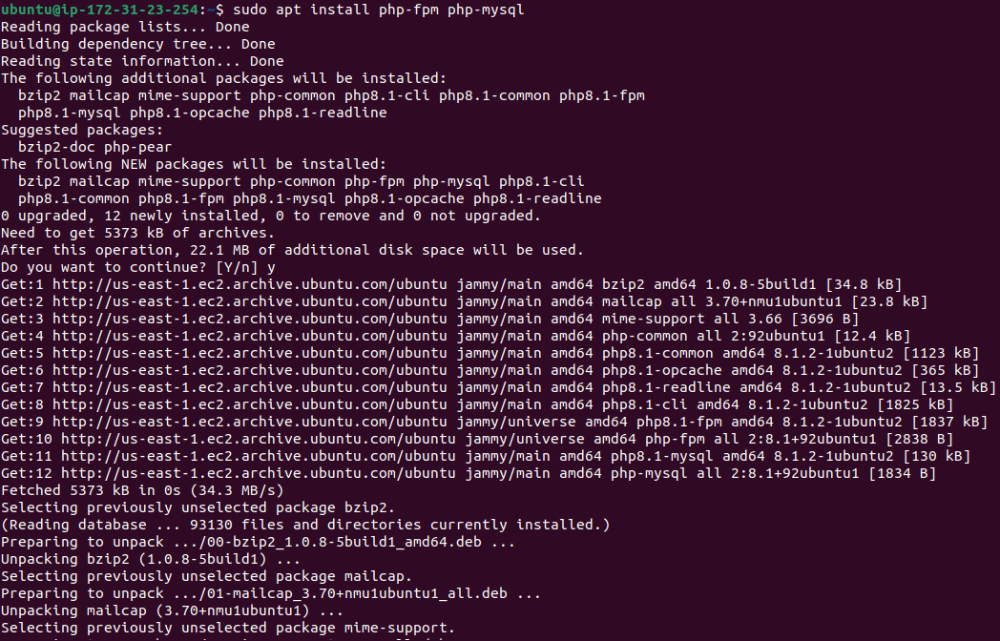

# Awesome Documentation Of DevOps Project-2 : LEMP STACK IMPLEMENTATION

# Step 1 - Installing The Nginx Web Server 

I am going to employ Nginx a high performance web server, in order to display web pages to my site visitors.

`sudo apt update`

`sudo apt install nginx`

To verify that nginx was successfully installed and is runing as a server in ubuntu, run:

`sudo systemctl status nginx`

For the output to be green and runing that means everything was corrected, and just launched the first Web Server in the Clouds.

So let try to check how we can accesss it locally in our Ubuntu shell, run:

`curl http://localhost:80
or
curl http://127.0.0.1:80`

As an output you can see some strangly formatted test, don't worry, just to make sure that the Nginx web service responds to 'curl' command with some payload.

Now is to test how the Nginx server can respond to requests from the internet, open a web browser and access the following url:

`http://<Public-IP-Address>:80`

With the following page output, that means the web server is now correctly installed and accessible through my firewall.

# Step 2 - Installing Of MYSQL

I need to install a Database Management System (DBMS) since i have a web server up and running, to be able store and manage data for the site in a relational database. The popular relational database management system used within PHP environments, so for that i will use MySQL in this project:

`sudo apt install mysql-server`

After installation of mysql-server, it's recommended that we run a security scrip that comes pre-installed with MySQL:

`sudo mysql_secure_installation`

This will ask if you want to configure the VALIDATE PASSWORD PLUGIN as follows:

`VALIDATE PASSWORD PLUGIN can be used to test passwords
and improve security. It checks the strength of password
and allows the users to set only those passwords which are
secure enough. Would you like to setup VALIDATE PASSWORD plugin?

Press y|Y for Yes, any other key for No:`

If answer is "yse", then to select a level of password validation as follows:

`There are three levels of password validation policy:

LOW    Length >= 8
MEDIUM Length >= 8, numeric, mixed case, and special characters
STRONG Length >= 8, numeric, mixed case, special characters and dictionary              file

Please enter 0 = LOW, 1 = MEDIUM and 2 = STRONG: 1`

Note: Regardless of whether we chose to set up the VALIDATION PASSWORD PLUGIN, the server will next ask to select and confirm a password for the MySQL root user.
But i choosed and recommend 0 = LOW, then create and confirm MySQL password.

Now let test and see if we can log in to the MySQL console:

`sudo mysql`

This will connect to the MySQL server as the administrative database user root as follows:

To exit the MySQL console, type exit or \q:

`mysql> exit`

The MySQL server is now installed and secured.

# Step 3 - Installing Of PHP

I have Nginx installed to serve my content and MySQL installed to store and manage my data. Now i can install PHP to process code and generate dynamic content for the web server.

To install these two core php packages at once that allows PHP to communicate with MySQL-based databases:

`sudo apt install php-fpm php-mysql` 

Now i have the PHP components installed.

# Step 4 - Configuring NGINX To Use PHP Processor

We can create server blocks (similar to virtual hosts in Apache) to encapsulate configuration details and host more than one domain on a single server, when using the Nginx web server. 

On Ubuntu 20.04, Nginx has server block enable by default and is configured to serve documents out of a directory at /var/www/html. 

Instead of modifying /var/www/html, i will create a root web directory structure within /var/www with my domain name projectLEMP as follows:

`sudo mkdir /var/www/projectLEMP`

Next, assign ownership of the directory with the $USER environment variable, which will reference your current system user:

`sudo chown -R $USER:$USER /var/www/projectLEMP`

Then, open a new configuration file in Nginx’s sites-available directory using your preferred command-line editor. Here, we’ll use nano:

`sudo nano /etc/nginx/sites-available/projectLEMP`

This will create a new blank file. Paste in the following bare-bones configuration:

Here’s what each of these directives and location blocks do:

listen — Defines what port Nginx will listen on. In this case, it will listen on port 80, the default port for HTTP.
root — Defines the document root where the files served by this website are stored.
index — Defines in which order Nginx will prioritize index files for this website. It is a common practice to list index.html files with a higher precedence than index.php files to allow for quickly setting up a maintenance landing page in PHP applications. You can adjust these settings to better suit your application needs.
server_name — Defines which domain names and/or IP addresses this server block should respond for. Point this directive to your server’s domain name or public IP address.
location / — The first location block includes a try_files directive, which checks for the existence of files or directories matching a URI request. If Nginx cannot find the appropriate resource, it will return a 404 error.
location ~ \.php$ — This location block handles the actual PHP processing by pointing Nginx to the fastcgi-php.conf configuration file and the php7.4-fpm.sock file, which declares what socket is associated with php-fpm.
location ~ /\.ht — The last location block deals with .htaccess files, which Nginx does not process. By adding the deny all directive, if any .htaccess files happen to find their way into the document root ,they will not be served to visitors.

When you’re done editing, save and close the file. If you’re using nano, you can do so by typing CTRL+X and then y and ENTER to confirm.

Activate your configuration by linking to the config file from Nginx’s sites-enabled directory:

`sudo ln -s /etc/nginx/sites-available/projectLEMP /etc/nginx/sites-enabled/`

This will tell Nginx to use the configuration next time it is reloaded. You can test your configuration for syntax errors by typing:

`sudo nginx -t`

You shall see following message:

`nginx: the configuration file /etc/nginx/nginx.conf syntax is ok
nginx: configuration file /etc/nginx/nginx.conf test is successful`

If any errors are reported, go back to your configuration file to review its contents before continuing.

We also need to disable default Nginx host that is currently configured to listen on port 80, for this run:

`sudo unlink /etc/nginx/sites-enabled/default`

When you are ready, reload Nginx to apply the changes:

`sudo systemctl reload nginx`

Your new website is now active, but the web root /var/www/projectLEMP is still empty. Create an index.html file in that location so that we can test that your new server block works as expected:

`sudo echo 'Hello LEMP from hostname' $(curl -s http://169.254.169.254/latest/meta-data/public-hostname) 'with public IP' $(curl -s http://169.254.169.254/latest/meta-data/public-ipv4) > /var/www/projectLEMP/index.html`

Now go to your browser and try to open your website URL using IP address:

`http://<Public-IP-Address>:80`

If you see the text from ‘echo’ command you wrote to index.html file, then it means your Nginx site is working as expected.
Your LEMP stack is now fully configured.

# STEP 5 – Testing PHP With NGINX

Your LEMP stack should now be completely set up, and you can do this by creating a test PHP file in your document root. Open a new file called info.php within your document root in your text editor:

`sudo nano /var/www/projectLEMP/info.php`

Type or paste the following lines into the new file. This is valid PHP code that will return information about your server:

`<?php
phpinfo();`

You can now access this page in your web browser by visiting the domain name or public IP address you’ve set up in your Nginx configuration file, followed by /info.php:

`http://`server_domain_or_IP`/info.php`

You will see a web page containing detailed information about your server:

After checking the relevant information about your PHP server through that page, it’s best to remove the file you created as it contains sensitive information about your PHP environment and your Ubuntu server. You can use rm to remove that file:

`sudo rm /var/www/your_domain/info.php`
